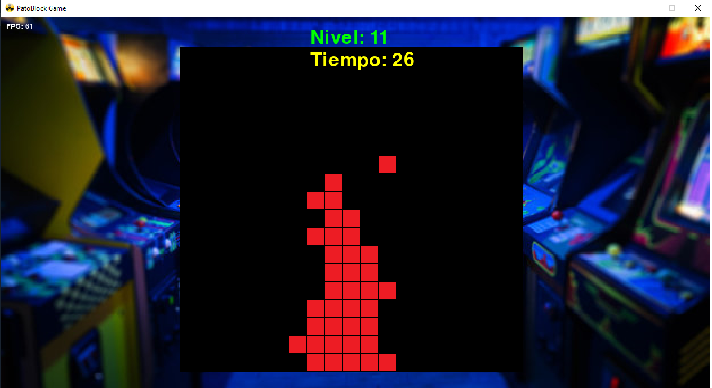

# PatoBlock Game

Un juego de apilamiento de bloques desarrollado en Python usando Pygame.

## Imagen del juego




## Requisitos

- Python 3.10.7 o superior
- Pygame 2.5.1 o superior

## Instalación

1. Clonar este repositorio:
```
git clone https://github.com/DATABEAMCL/game-pato-block-py.git
```

2. Instalar dependencias:
```
pip install -r requirements.txt
```

3. Ejecutar el juego:
```
python main.py
```

## Cómo jugar

1. **En el menú principal:**
   - Presiona **1** para iniciar el juego (necesitas tener créditos)
   - Presiona **2** para salir
   - Presiona **i** para insertar una moneda (añadir créditos)

2. **Durante el juego:**
   - Presiona **Enter** para colocar el bloque en la posición actual
   - Presiona **Esc** para regresar al menú principal

3. **En la pantalla de Game Over:**
   - Presiona **Esc** para regresar al menú principal

## Objetivo del juego

Apila los bloques de manera que coincidan con los bloques de la fila anterior. Cada vez que colocas un bloque correctamente, continúas jugando. Si los bloques no coinciden, pierdes bloques disponibles. Si te quedas sin bloques, es Game Over.

## Generar ejecutable

* Instalar PyInstaller:
```
pip install pyinstaller
```

* Generar ejecutable:
```
pyinstaller --onefile --windowed main.py
```

## Créditos

Desarrollado por [https://github.com/alvarockcl](https://github.com/alvarockcl)